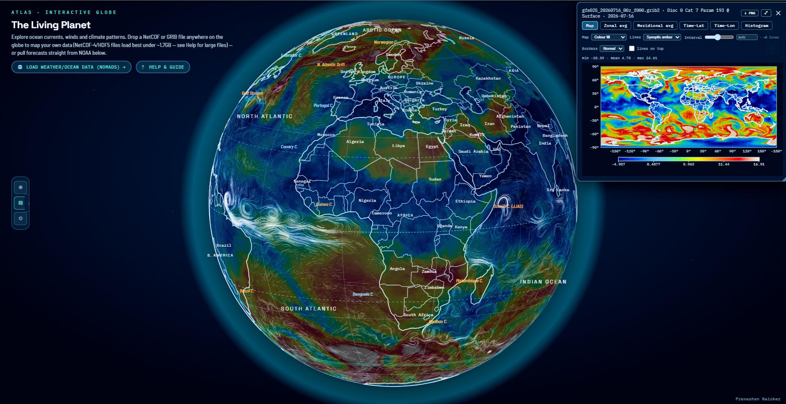

# Interactive Globe · 
[](https://doi.org/10.5281/zenodo.21401218)

This is a 3-D atlas with data exploration and analysis tools. Functions in any browser, with no server and no internet connection required when analysing downloaded geospatial data (NetCDF and GRIB2)

## Features

This functions as a geospatial data exploration environment:

- **In-browser trend fitting on your own data** — load any NetCDF / GRIB2 file and run per-cell linear trend analysis (full series, equal splits, custom date ranges, rolling windows) with statistical significance masking, reported in the data's native cadence. 
- **A Teleconnection/statistics toolkit** — lagged correlation maps, composite (high/low index phase) analysis, EOF/PCA (dominant spatial modes + principal-component time series), and multiple regression (up to 6 predictors, β/R²/t/p per cell, with its own lag sweep) — all fit directly against whatever you loaded, in the data's own native time cadence (day/month/year auto-detected). Multi-lag results are browsable by statistic first, lag second, so you pick "β(ONI)" once and scrub every lag without re-selecting it.
- **Region extraction with spherical geometry** — draw a polygon, pick a country, preset regions or custom cordinates and get a cos-latitude-weighted mean clipped by a spherical point-in-polygon test.
- **Derived layers across mismatched grids** — combine two overlays with a formula (`A−B`, `sqrt(A²+B²)`, ratios) even when they come from different grids; the engine resamples with correct longitude wraparound.
- **GRIB2 + HDF5 decoded entirely in the browser** — including JPEG2000-packed GRIB2 messages (e.g. ECMWF output). Raw bytes in, rendered globe out. Your data never leaves the machine.
- **Live NOAA pulls with byte-range loading** — the built-in NOMADS dialog fetches only the byte ranges for the variables you choose from GFS / GDAS / GEFS, without downloading the full file.
- **GPU particle flows from reanalysis data** — surface currents (ORAS5/CMEMS), ERA5 10 m winds and 300 hPa jet stream rendered as animated particle fields via a WebGPU → WebGL2 → CPU fallback chain alongside gyres, upwelling zones, traced shipping lanes, and seasonal ITCZ.
- **Hovmöller diagrams, zonal means, histograms** — built-in time–latitude and time–longitude cross-sections, meridional/zonal averages, and robust histograms with automatic outlier-spike detection. Export to CSV or PNG.


## Download

[](https://github.com/npreneshen/living-planet/releases/download/v1.1.0/living.planet.html)

[**Download Living Planet** (single HTML file, ~8 MB)](https://github.com/npreneshen/living-planet/releases/download/v1.1.0/living.planet.html)

**[Try it in your browser →](https://living-planet.pages.dev)**
> Works best on a modern desktop or laptop browser (Chrome, Edge, Firefox, Safari 16+). Runs on most mobiles too — particle rendering scales itself down automatically on touch/lower-end devices.



## Quick start

```
dist/interactive-globe.html   ←  double-click, or open in any modern browser
```

Everything below is for those who wish to modify or rebuild the app.

---

## Repository layout

```
dist/interactive-globe.html    the deliverable: the full standalone app
build.py                       reassembles dist/ from src/ (stdlib only)
src/
  manifest.json                exact concatenation order for build.py
  html/                        head + page-shell + modal markup chunks
  css/                         stylesheets
  js/                          application modules (see below)
  data/                        embedded datasets (atlas topology, 50 m LOD)
  vendor/                      third-party libraries (d3, topojson,
                               netcdfjs, h5wasm, jpx JPEG2000 decoder, grib2)
extraction/                    Python scripts that produced the embedded
                               currents / wind / jet fields (see its README)
```

The main application modules in `src/js/`:

| module | role |
|---|---|
| `atlas-core.js` | globe bootstrap, atlas data wiring |
| `globe.js` | projection, drag/zoom, layer rendering, labels, particles |
| `globe-nc.js` | NetCDF/HDF5/GRIB2 overlay engine: decoding, caching, colormaps, contours, trends, derived layers, region extraction, plots, teleconnection tools (correlation/composite/EOF/regression) |
| `globe-adv.js` | advanced embedded fields (real wind/current/jet data) |
| `globe-features.js` | curated geography: currents, gyres, shipping lanes… |
| `globe-tl.js` | master timeline synchronising all overlays |
| `globe-info.js` | feature explanation database (click-popups) |
| `globe-ann.js`, `globe-rgn.js` | annotations, region helpers |
| `globe-live-feeds-bundle.js` | live weather / quake / air-quality feeds |
| `nomads-ui.js` | the NOMADS direct-load dialog |

## Building the standalone from source

```bash
python build.py
# → dist/interactive-globe.html  (+ sha256 printed)

# paranoia mode: byte-compare the output against a known-good file
python build.py --check path/to/reference.html
```

`build.py` needs nothing but the Python 3 standard library. It concatenates the segments listed in `src/manifest.json` — raw HTML chunks verbatim, and each `.js`/`.css` module re-wrapped in its original `<script>`/`<style>` tag — which reproduces the standalone **byte-for-byte**.

### Editing workflow

1. Edit the relevant module under `src/`.
2. `python build.py`
3. Open `dist/interactive-globe.html` and test.

Do not edit `dist/interactive-globe.html` directly — it is generated.

## Data notes & limits

- **NetCDF-4/HDF5 files load best under ~1.7 GB**: the in-browser HDF5 engine (h5wasm) runs in a WebAssembly heap capped at 2 GB and the whole file must fit inside it. Split larger files first (e.g. `ncks -d valid_time,0,199 big.nc part1.nc`) and drop the parts in as a series — the app merges them by time. Classic NetCDF-3 and GRIB2 don't share this ceiling.
- Land/sea-masked products (SST, soil moisture…) keep their own mask; the histogram flags suspicious value spikes (e.g. unmasked zeros) and region extraction warns when a country mean rests on only a handful of coastal cells.
- Everything runs client-side: your data never leaves the machine.

## Regenerating the embedded climatology fields

The particle-flow base layers (surface currents, 10 m winds, jet stream) are quantized snapshots produced from real reanalysis data by the scripts in [`extraction/`](extraction/README.md). To refresh them with a different year or dataset, follow that README, then rebuild.

## License

Project source code is licensed under the **[Apache License 2.0](LICENSE)**.

**Data credits**
- Basemap topology: [Natural Earth](https://www.naturalearthdata.com/) via world-atlas (public domain).
- Embedded fields derived from **ERA5** (Copernicus Climate Change Service) and **ORAS5 / CMEMS** ocean reanalysis; live data from **NOAA NOMADS**.
- Bundled libraries: d3, topojson-client, netcdfjs, h5wasm, a JPEG2000 decoder (jpx), each under its own license.